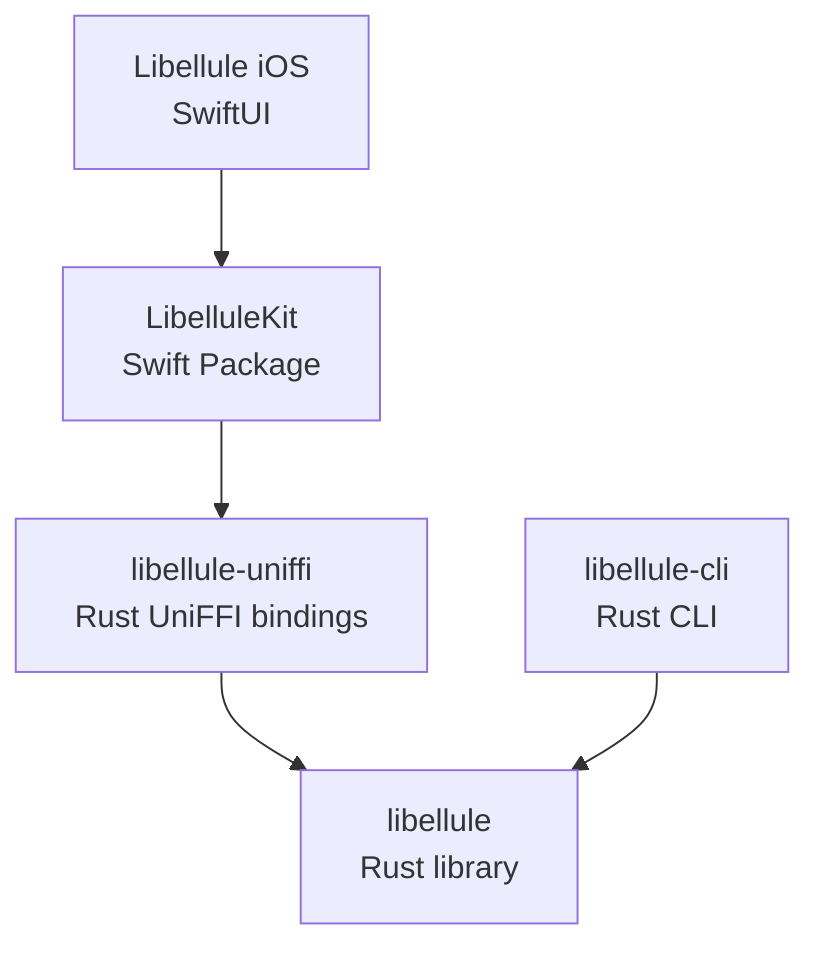

# Libellule

A Rust implementation of the PRONOTE protocol.

> [!WARNING]
> Libellule is **not affiliated with, endorsed by, or sponsored by INDEX ÉDUCATION**.

## Features

- [ ] Connection
  - [ ] Instance selection
    - [x] URL
    - [ ] QR code
    - [ ] Geolocation
    - [ ] Search
  - [x] Authentication
- [ ] Timetable
  - [ ] Lessons
    - [x] Basic information
    - [ ] Detailed view
    - [ ] Contents
    - [ ] Status (cancelled, moved, ...)
  - [ ] Menu
    - [x] Food list
    - [ ] Allergies
    - [ ] Labels
- [ ] Homework
  - [x] Basic information
  - [ ] Update status
  - [ ] View attachments
  - [ ] Submit files and recordings
- [ ] Grades
  - [x] Full list
  - [ ] Sort by date
  - [ ] Group by subject
  - [ ] Average calculation
- [ ] Absences
- [ ] Communication
  - [ ] Polls
  - [ ] Messages
  - [ ] Informations
  - [ ] Agenda

## Architecture

## Security

Authentication and API requests are sent directly to your PRONOTE server. The encrypted credentials are only stored locally in the iOS app for faster logins.

## Legal

Libellule is an independent implementation of the PRONOTE protocol developed through observation of publicly accessible network communications. No proprietary source code from the official PRONOTE software has been copied.

PRONOTE is a trademark of INDEX ÉDUCATION.

## License

Released under the GNU General Public License v3.0.
